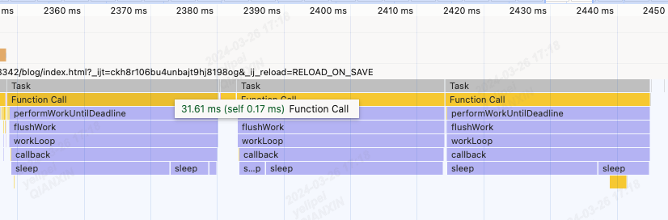

## MessageChannel
* Channel Messaging API 的 MessageChannel 接口允许我们创建一个新的`消息通道`，
* 并通过它的`两个 MessagePort 属性发送数据。`
* 此特性在 `Web Worker 中也可用`
```shell
MessageChannel.port1 只读
MessageChannel.port2 只读
```
* `一般 MessageChannel 和 postMessage 会进行对比`
  postMessage(`跨文档通信`) 适用于简单的`跨文档、跨域通信`，操作简单，灵活性较强。
  MessageChannel(`通道通信`) 适用于需要`更精确、高效的任务调度场景`，提供了更高的控制性和性能。

#### 特点
* 通过 MessageChannel 构建`专门的消息通道`。
* 提供了更灵活、更精确的控制，适用于`高性能、复杂任务调度`场景。
* 使用 MessagePort 进行消息传递，支持双向通信。
* 和postMessage一样，都是宏任务，都是异步的

#### 优缺点
* 优点：
  提供了更高的控制性，可以确保消息的顺序、优先级。
  `可以避免与其他消息混淆`。
* 缺点：
  相对于 postMessage 来说，使用稍微复杂一些。
  通常用于特定场景，不太适合简单的通信需求。
  `不能跨域通信`
  `只能port1和port2一对一通信`

#### 使用场景
* 任务调度：如 React Scheduler 等需要进行`任务调度、优先级控制`的场景。
* 高性能计算：对于需要`高效传输大量数据`的场景。

#### 例子
```html
<!DOCTYPE html>
<html lang="en-US">
<head>
    <meta charset="utf-8" />
    <meta http-equiv="X-UA-Compatible" content="IE=edge" />
    <meta name="viewport" content="width=device-width" />
    <title>Channel messaging demo</title>
</head>
<body>
<h1>Channel messaging demo</h1>
<p class="output">My body</p>
<iframe src="./page2.html" width="480" height="320"></iframe>
<script>
    const channel = new MessageChannel();
    const output = document.querySelector('.output');
    const iframe = document.querySelector('iframe');

    // Wait for the iframe to load
    iframe.addEventListener("load", onLoad);

    function onLoad() {
        // 监听port1的消息
        channel.port1.onmessage = onMessage;
        // 发送消息给port2
        iframe.contentWindow.postMessage("Hello from the main page!", "*", [
            channel.port2,
        ]);
    }

    // Handle messages received on port1
    function onMessage(e) {
        output.innerHTML = e.data;
    }
</script>
</body>
</html>
```

* pages.html
```html
<!DOCTYPE html>
<html lang="en-US">
<head>
    <meta charset="utf-8" />
    <meta http-equiv="X-UA-Compatible" content="IE=edge" />
    <meta name="viewport" content="width=device-width" />
    <title>My page title</title>
</head>
<body>
<p class="output">iFrame body</p>
<script>
    const output = document.querySelector(".output");

    window.addEventListener("message", onMessage);
    // 接收到port1的消息
    function onMessage(e) {
        output.innerHTML = e.data;
        // 发送消息给port1
        e.ports[0].postMessage("Message back from the IFrame");
    }
</script>
</body>
</html>
```

#### react使用 MessageChannel 实现时间切片
* 点击按钮后可以看到 MessageChannel 的三个任务执行时间是连在一起的 `在(animation task、paint)之前执行`
* 而不是像requestAnimationFrame 需要放入任务队列，等待paint等操作后从任务队列中取出执行 `(在animation之后，paint之前执行)`


```html
<!DOCTYPE html>
<html lang="en-US">
<head>
    <meta charset="utf-8" />
    <meta http-equiv="X-UA-Compatible" content="IE=edge" />
    <meta name="viewport" content="width=device-width" />
    <title>demo</title>
</head>
<body>
<div onclick="start()">start</div>
<script>
    // 用于模拟代码执行耗费时间
    const sleep = delay => {
        for (let start = Date.now(); Date.now() - start <= delay;) {}
    }

    // performWorkUntilDeadline 的执行时间，也就是一次批量任务执行的开始时间，通过现在的时间 - startTime，来判断是否超过了切片时间
    let startTime;

    let scheduledHostCallback;
    let isMessageLoopRunning = false;
    let getCurrentTime = () => performance.now();

    const taskQueue = [{
        expirationTime: 1000000,
        callback: () => {
            sleep(30);
            console.log(1)
        }
    }, {
        expirationTime: 1000000,
        callback: () => {
            sleep(30);
            console.log(2)
        }
    }, {
        expirationTime: 1000000,
        callback: () => {
            sleep(30);
            console.log(3)
        }
    }]

    function requestHostCallback(callback) {
        scheduledHostCallback = callback;
        if (!isMessageLoopRunning) {
            isMessageLoopRunning = true;
            schedulePerformWorkUntilDeadline();
        }
    }

    const channel = new MessageChannel();
    const port = channel.port2;

    function performWorkUntilDeadline() {
        if (scheduledHostCallback !== null) {
            const currentTime = getCurrentTime();
            startTime = currentTime;
            const hasTimeRemaining = true;

            let hasMoreWork = true;
            try {
                hasMoreWork = scheduledHostCallback(hasTimeRemaining, currentTime);
            } finally {
                console.log('hasMoreWork', hasMoreWork)
                if (hasMoreWork) {
                    schedulePerformWorkUntilDeadline();
                } else {
                    isMessageLoopRunning = false;
                    scheduledHostCallback = null;
                }
            }
        } else {
            isMessageLoopRunning = false;
        }
    };

    channel.port1.onmessage = performWorkUntilDeadline;

    let schedulePerformWorkUntilDeadline = () => {
        port.postMessage(null);
    };

    function flushWork(hasTimeRemaining, initialTime) {
        return workLoop(hasTimeRemaining, initialTime);
    }

    let currentTask;

    function workLoop(hasTimeRemaining, initialTime) {
        currentTask = taskQueue[0];
        while (currentTask != null) {
            console.log(currentTask)
            if (
                currentTask.expirationTime > initialTime &&
                (!hasTimeRemaining || shouldYieldToHost())
            ) {
                break;
            }

            const callback = currentTask.callback;
            callback();

            taskQueue.shift()

            currentTask = taskQueue[0];
        }

        if (currentTask != null) {
            return true;
        } else {
            return false;
        }
    }

    const frameInterval = 5;

    function shouldYieldToHost() {
        const timeElapsed = getCurrentTime() - startTime;
        if (timeElapsed < frameInterval) {
            return false;
        }
        return true;
    }
    function start(){
        requestHostCallback(flushWork)
    }

</script>
</body>
</html>
```


