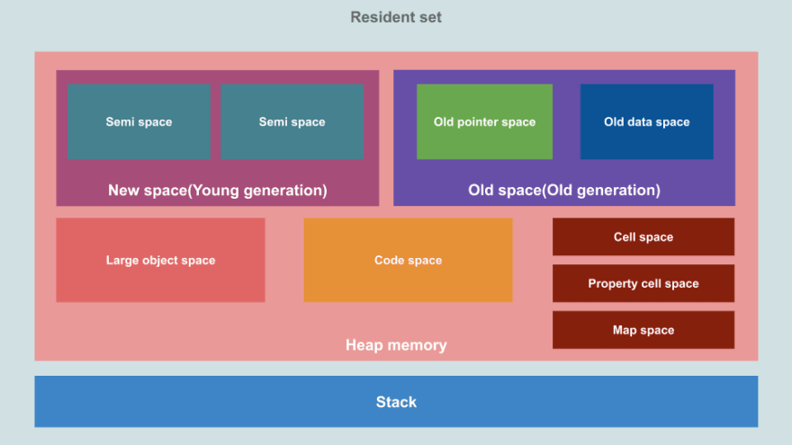

## 分代策略
* javascript中，`绝大多数对象的生存期很短`，只有某些对象的生存期较长
* 内存模型拥有的第一个空间是新空间，这是首先分配内存的地方，这个空间的数据通常非常小

* 在新生区的内存分配非常容易：我们只需保有一个`指向内存区的指针`，不断根据新对象的大小对其进行`递增`即可。
* 当该指针达到了新生区的末尾，就会有一次清理（`小周期`），清理掉新生区中`不活跃的死对象`。
* 对于活跃`超过2个小周期的对象`，则需将其移动至老生区。

* 而在`老生区`则使用`标记清除`的算法来进行垃圾回收。
* V8通过分别对新生代对象和老生代对象使用`不同的垃圾回收算法`来提升回收的效率。这就是所谓的`分代策略`。

### V8引擎堆空间分隔
* [可视化内存分割策略]("https://deepu.tech/memory-management-in-v8/")
* 根据分代策略，V8将堆空间进行了分隔
* 默认情况下，64位环境下的V8引擎的`新生代`内存大小`32MB`、`老生代`内存大小为`1400MB`，
* 而32位则减半，分别为16MB和700MB

#### 对于一个对象所占的内存空间
* 对于一个对象所占的内存空间，也涉及两个概念：shallow size和retained size。
1. `shallow size`就是`对象本身占用内存的大小`，不包含其引用的对象。常规对象（非数组）的shallow size有其成员变量的数量和类型决定
2. retained size是该对象自己的shallow size，加上`从该对象能直接或间接访问到对象的shallow size之和`。
* 换句话说，retained size是`该对象被GC之后所能回收到内存的总和`。

#### 新生区
* 新空间或“年轻一代”是新物体生存的地方，其中大多数物体都是短暂的
* 这个空间很小，有两个半空间
* 这个空间是由“Scavenger(`Minor GC 次要GC`)”管理的
* 新空间的大小可以使用 --min_semi_space_size（初始）和--max_semi_space_size（最大）V8 标志来控制。

#### 老生区
* 老一代”是在“新空间”中存活了两个`次要 GC 周期`的对象被移动到的位置
* 这个空间是由Major GC(Mark-Sweep & Mark-Compact)来管理的” 
* 旧空间的大小可以使用--initial_old_space_size（初始）和--max_old_space_size（最大）V8 标志来控制
* `全局对象(例如：window) 会一直待在老生代空间(一般全局对象一开始就在老生代空间)，因为不会被垃圾回收`

* 这个空间分为两部分：
1. `旧指针空间`：包含具有`指向其他对象`的`指针`的`对象`(例如：该对象还有属性指向其他对象， obj.a=obj2)。
2. `旧数据空间`：包含`仅包含数据的对象`（`没有指向其他对象的指针`）。
* `字符串、装箱数字和未装箱双精度数组`在“新空间”中存活了两个次要 GC 周期后被移至此处。

#### 大对象空间
* 这是`大于`其他空间`大小限制`的对象所在的位置。`不需要走新生代->老生代步骤，一创建就在大对象空间了`
* 垃圾收集器永远不会移动大对象。
* 后续的标记，销毁，清理 也都是在大对象空间

#### 代码空间
* 这是即时（`JIT`）编译器存储`编译后的代码块(可执行的代码，机器码)`的地方。
* 这是唯一具有`可执行内存的空间`（尽管Codes可能会在“大对象空间”中分配，并且这些空间也是可执行的）。

* 可执行内存是计算机内存中的一部分，用于`存储正在执行的程序的指令和数据`。
* 在一个运行的程序中，可执行内存包含了`程序的代码段、堆栈段和全局变量`等。

#### Cell空间、属性Cell空间和 Map空间
* 这些空间分别包含Cells、PropertyCells和Maps。
* 这些区域共同组成了 V8 引擎的堆内存，用于存储 JavaScript 对象的`内容、属性和元信息`
* 每个空间都包含`大小相同`的对象，并且对它们指向的对象类型有一些限制，这简化了收集。`内存结构很简单`

### 空间的基本组成单位：页面Page
* 每个空间都由一组`页面`组成。页是从操作系统分配的`连续内存块`。
* 除大对象空间外，`每个页面的大小为 1MB`。

## 基于分代策略，看下具体的垃圾回收过程
### 次要GC 清道夫
* 次要GC 使新生代空间保持紧凑和清洁
* 对象分配在新空间中，该空间相当小（1 到 8 MB 之间，具体取决于行为启发法）。
* “新空间”中的分配非常便宜：有一个`分配指针`，每当我们想为新对象新增内存空间时，我们都会`增加`该指针的引用地址。
* 当分配指针到达`新空间的末尾`时，就会`触发minor GC`。
* 这个过程也称为 `Scavenger`，它实现了切尼算法。它经常发生并使用并行辅助线程并且速度非常快。

#### 次要GC的组成
* 新空间被分为两个`大小相等`的半空间：`to-space`和`from-space`
* 大多数分配都是在`源空间`中进行的（某些类型的对象除外，例如始终在旧空间中分配的可执行代码）。
* `当 from-space 填满时，会触发 Minor GC`。

#### 次要GC的流程
1. 让我们假设当我们开始时“from-space”上已经有对象了（块01到06标记为已用内存）
2. 该过程创建一个新对象(07)
3. V8 尝试从 from-space 获取所需的内存，但那里没有可用空间来容纳我们的对象，因此 V8 触发了 Minor GC
4. Minor GC从GC root开始递归地遍历 `from space`中的对象graph， 以查找已使用或者已存活的对象
这些对象`被移动到` `to-space` 中的page. 并且对应的引用&引用的对象也会被移动到to-space
重复此操作，直到扫描来自 from-space 的所有对象。到此结束的时候，`to-space` 会`自动压缩，减少碎片`
5. Minor GC 现在会清空 from space,因为这里剩余的任何对象都是垃圾
6. Minor GC 交换 `from-space`和 `to-space`，现在所有对象都在 `from-space`中，to-space为空
7. 新对象在from-space分配内存
8. 让我们假设一段时间过去了，“from-space”上现在有更多对象（块 07 到 09 标记为已用内存）
9. 应用程序创建一个新对象(10)
10. V8 尝试从“from-space”获取所需的内存，但那里没有可用空间来容纳我们的对象，因此 V8 触发了第二次次要 GC
11. 重复上述过程，在`第二次 Minor GC 中`幸存下来的任何`存活对象`都将被移动到“`老生代空间`”。
* 首次幸存者被转移到`to space`，剩余的垃圾被清除
12. Minor GC 交换 `from-space`和 `to-space`，现在所有对象都在 `from-space`中，to-space为空
13. 新对象在from-space分配内存 (`和7一样，每次其实都是在from-space分配新对象的内存`)

### Major GC 主要GC
* 这种类型的GC使`老年代空间保持紧凑和干净`。
* 当 V8 根据动态计算的限制确定`没有足够的旧空间`时，会触发此操作，因为它会被 `Minor GC(次要GC)` 周期填满。

* Scavenger 算法非常适合小数据量，但对于旧空间等大堆来说不切实际，因为它具有`内存开销`，
* 因此主要 GC 是使用 Mark-Sweep-Compact 算法完成的。

* 它使用`三色（白-灰-黑）标记系统`。因此，主要 GC 是一个三步过程，第三步的执行取决于碎片启发式。
1. 标记
* 垃圾收集器识别哪些对象正在使用，哪些对象未使用。
* 可从 GC 根（堆栈指针）递归访问的对象被标记为活动的
* 对`堆的深度优先搜索`，可以将其视为有向图

2. 清理
* 垃圾收集器遍历堆并记下任何`未标记为活动的对象的内存地址`。
* 该空间现已在空闲列表中标记为空闲，可用于存储其他对象

3. 压缩
* 清扫后，如果需要，`所有幸存的物体将被移动到一起`。这将减少碎片并提高向新对象分配内存的性能

#### Major GC 优化
* Major GC也称为`stop-the-world GC`，因为它们在执行 GC 时会在进程中引入`暂停时间`。
* 为了避免这种情况，V8 使用了诸如:

1. 增量GC：GC 是通过`多个增量步骤`完成的，而不是一次。
2. 并发标记：使用`多个辅助线程`同时完成`标记`，而不影响主 JavaScript 线程。
* 写屏障用于跟踪 JavaScript 创建的对象之间的新引用，同时帮助器同时进行标记。
3. 并发清理/压缩：清理和压缩在`辅助线程`中同时完成，不会影响主 JavaScript 线程。
4. 懒惰扫地(`懒惰整理/清除`)。`延迟`清理涉及延迟`删除`页面中的垃圾，直到需要内存为止。

### 整体垃圾回收策略
1. 假设许多次 Minor GC 周期已经过去，旧空间几乎已满，V8 决定触发一次“Major GC”
2. Major GC从堆栈指针开始递归地遍历对象图，将旧空间中被使用的对象标记为活动对象（已用内存），将剩余对象标记为垃圾对象（孤儿）。
* 这是使用多个并发辅助线程完成的，每个辅助线程都遵循一个指针。这不会影响主 JS 线程。
3. 当并发标记完成或达到内存限制时，`GC 使用主线程执行标记最终确定步骤`。这引入了一个`小的暂停时间`。
4. Major GC 现在使用并发扫描线程将所有孤立对象的内存标记为空闲。
* 还会触发并行压缩任务，将相关的内存块移动到同一页面，以避免碎片。指针在这些步骤中更新。

