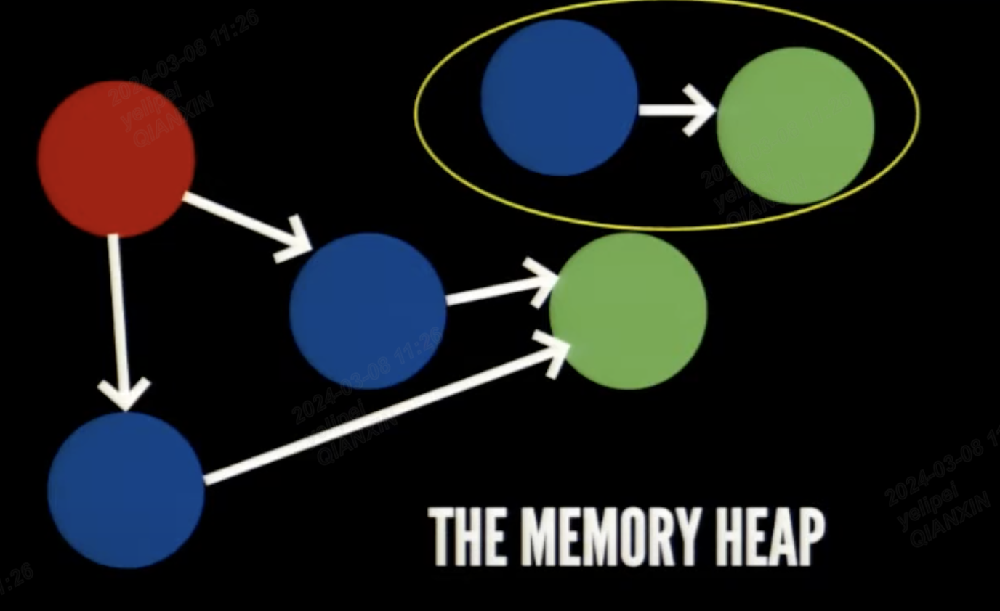
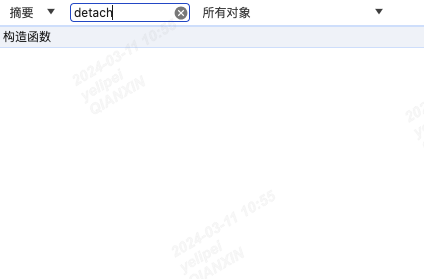
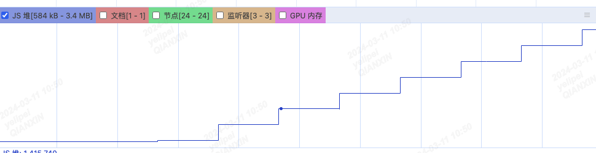
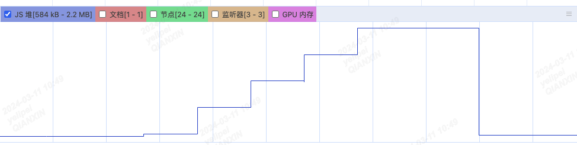

## 垃圾回收
* 由于`字符串、对象和数组没有固定大小`，所以当他们的大小已知时，才能对他们进行动态的存储分配。
* JavaScript 在每次创建字符串、数组或对象时，解释器都必须分配内存来存储那个实体。
* 只要像这样动态地分配了内存，最终都要释放这些内存以便他们能够被再用，
* 否则，JavaScript 的解释器将会消耗完系统中所有可用的内存，造成系统崩溃。

* JavaScript 通过 `自动垃圾收集机制` 实现内存的管理。
* 垃圾回收机制通过垃圾收集器`每隔固定的时间段`（周期性）找出那些不再需要继续使用的变量，执行一次释放占用内存的操作。

* 不再需要继续使用的变量也就是`生命周期结束的变量`。
1. 局部变量：在`局部作用域`中，当`函数执行完毕`，局部变量也就没有存在的必要了（`除了闭包`），因此垃圾收集器很容易做出判断并回收
2. 全局变量：但是`全局变量的生命周期`直到浏览器`卸载当前tab页面`才会结束，`也就是全局变量不会被当成垃圾变量回收`。所以声明一个全局变量的时候，我们一定要慎重的考虑，
* 在使用完这个变量的对象之后，我们是否还在需要这个对象，如果不需要的话，`我们应该手动的将这个变量置为空（null）`，这样在下一次垃圾回收的时候，就能去释放这个变量上一次指向的值

### 引用计数法
* 引用计数法： `跟踪记录每个值被引用的次数`，当声明了一个变量并将一个引用类型赋值给该变量时，则这个值的引用次数就是 1，
* 如果这个值再被赋值给另一个变量，则引用次数`加 1`。相反，如果包含对这个值引用的变量又引向了另外一个值，
* 则这个值的引用次数就减 1。
* 当这个`引用次数变成 0 时`，则说明没有办法再访问这个值了，因而`就可以将其所占的内存空间给收回来`。
* 这样，垃圾收集器下次再运行时，它就会释放那些引用次数为 0 的值所占的内存。

#### 引用计数法的问题：循环引用
* 这种垃圾收集方式存在一个比较大的问题就是`循环引用`，
* 就是说对象 a 包含一个指向 b 的指针，对象 b 也包含一个指向 a 的引用。 
* 这就可能造成大量`内存得不到回收`，也就是`内存泄漏`，这是`因为它们的引用次数永远不可能是 0`。
```javascript
function problem() {
  var a = new Object();
  var b = new Object();
  a.ref = b;
  b.ref = a;
}
```

### 标记清除法
* 当程序执行流入到`一个函数`中时，`会创建该函数的执行上下文`，
* 执行上下文中的变量都会被标记为 `进入环境`，从逻辑上讲，`永远不能释放 进入执行环境 变量所占用的内存`。
* 因为只要执行流进入相应的执行上下文，就可能会用到这些变量。

* 标记清除的工作流程：
1. 标记阶段
* 垃圾回收器会从`根对象(root)`开始，根对象是由 JavaScript 运行环境提供的全局对象（比如 window 对象）以及当前执行上下文中的变量对象。
* 垃圾回收器将`根对象标记为活动对象`。
* 从根对象开始，`递归遍历`对象`引用的链条`，标记`所有能够被访问到的对象`为`活动对象`。
* 这个过程通过遍历整个对象图谱`（Object Graph）`完成，所有被访问到的对象都会被标记为活动对象。

2. 清除阶段
* 在`标记阶段完成后`，垃圾回收器会对堆内存中的所有对象进行扫描，将`未标记为活动对象的对象`视为`垃圾对象`。
* 垃圾回收器会回收这些垃圾对象所占用的内存空间。
* `清除`后的内存空间可以被后续的 JavaScript 代码重新使用。

3. 内存回收
* 在清除阶段完成后，垃圾回收器会进行`内存的整理`和`回收`。
* `整理内存`的过程包括将`存活对象移动到一起`，以便为新对象分配`连续的内存空间`，从而`减少内存碎片化`。
* `回收的内存空间`被加入到`可用内存池`中，以供`后续的内存分配`使用。

* 通常情况下，垃圾回收器会在每次进行内存回收之前都`重新从根对象开始执行标记阶段`。
* 这是因为 JavaScript 的作用域链是动态的，对象之间的引用关系也可能随着代码的执行而动态变化，所以`需要重新从根对象开始``标记`活动对象。



#### javascript引用使用标记清除法
* JavaScript 引擎的垃圾回收机制是`标记清除法`，判断内存是否可回收的依据是`可达性`，它是对`引用计数法`的`改良`，
* 对象间的循环引用问题不会引起回收问题，因为判断是否可回收的依据是变量`是否可达`。
* 这种算法下存在一个`根节点`，它始终不会被回收，称为 `GC Root`，比如 JavaScript Runtime 的全局对象，
* 在浏览器中叫 `window` 以及 `DOM 树根节点``都是 GC Root`

* 代码中引用数为 0 的对象一定无法从 GC Root 访达，也就是说某个对象引用计数法认为它应该被回收的话，那么标记清除法也会将其回收

## 堆栈溢出
* 指`内存空间`已经`被申请完`，没有足够的内存提供了。

### 内存泄漏
* 指的是申请的内存空间在执行完毕后没有及时销毁，导致占用空闲内存
* 内存泄漏过多的话，就可能导致堆栈溢出，申请不到新的内存

* 即使 1Byte 的内存，也叫内存泄漏，并不一定是导致浏览器奔溃、卡顿才能叫内存泄漏
* `一般是堆区内存泄漏`，栈区不会泄漏。基本数据类型的值保存在栈中，引用数据类型保存在堆中。所以`一般指的是对象、数组等发生内存泄漏`。

#### 常见的内存泄漏的原因
* 全局变量引起的内存泄漏
* 没有被清除的定时器
* 闭包

* 对应解决方式：
1. 减少不必要的全局变量
2. 及时清除定时器
3. 减少闭包的使用（因为闭包会导致内存泄漏）

* `分离的 DOM 引用`
```html
<body>
  <button>移除列表</button>
  <ul id="list">
    <li>项目1</li>
  </ul>
  <script type="text/javascript">
    var button = document.getElementById('button');
    var list = document.getElementById('list');

    button.addEventListener('click', function () {
      list.remove();
    });
  </script>
</body>
```
* `我们在js runtime的window声明了list变量，然后点击一次按钮，删除了list对应的dom节点`
* 但是由于我们的list 变量还是全局变量，所以导致我们的DOM节点引用分离了，应该被标记清除掉
* 但是由于还是全局变量，所以是分离的dom节点，在页面看不到，在 `Memory -> Heap Snapshot -> Take Snapshot detached 还存在`
* `还是会占用内存`!


* 解决方案：`不使用全局变量`
```javascript
    var button = document.getElementById('button');

    button.addEventListener('click', function () {
        var list = document.getElementById('list');
        if(list){
            list.remove();
        }
    });
```



#### 定时器
* 定时器没有被清除，定时器的回调函数以及`内部依赖的变量都不能被回收`，造成内存泄漏。
* `<button onclick="add()">add</button>注意要使用add(), 否则使用add会导致add函数没有释放内存`
```html
<button onclick="add()">add</button>
<button onclick="remove()">remove</button>

<script>
    let timerId
    function add(){
    let list = [];
    timerId = setInterval(function () {
    list.push(new Array(10*10000).fill(0));
}, 1000);
}
    function remove(){
    clearInterval(timerId);
}
</script>
```
* 没有点击remove按钮的话，那么就没有执行垃圾回收


* `在定时器完成工作的时候，手动清除定时器`


#### console.log导致内存泄漏
* 使用 console.log 语句打印调试信息，因为`控制台要始终保持他们的引用!!!`，以便随时查看，
* 所以他们的内存也`无法被回收`，所以建议`生产环境下 去除控制台打印`。


