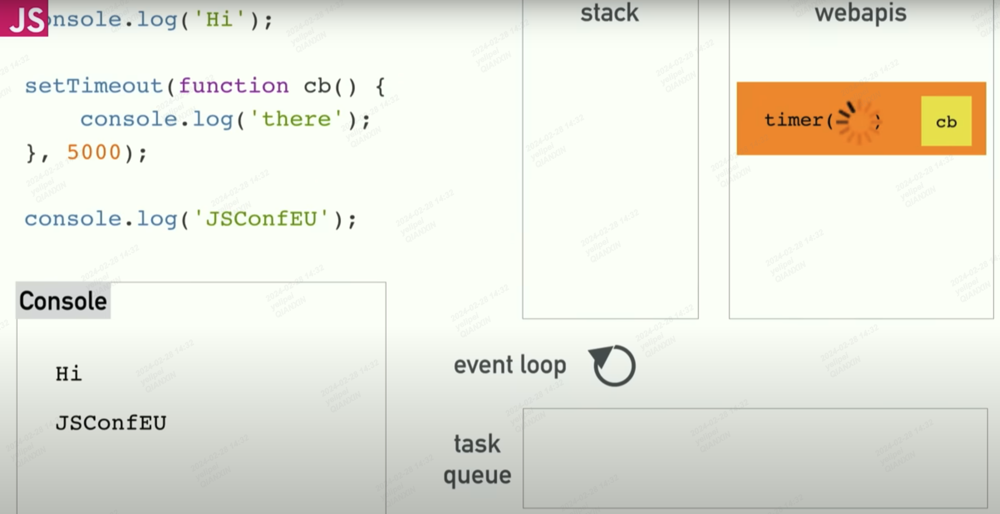

## EventLoop
* 解答为什么js是单线程的，却又可以实现异步
* [eventLoop探索，很有帮助！](https://www.youtube.com/watch?v=8aGhZQkoFbQ)


* 回调队列指的是宏任务和微任务提供的回调函数！

#### 执行到宏任务/微任务会如何处理？
* 执行到宏任务/微任务,例如执行到 setTimeout 会把任务放入浏览器提供的web api中进行处理
* 然后，浏览器会计时，`当延迟时间到达后，会将回调函数放入任务队列（Task Queue）中`。
* 这个过程是`异步的`，JavaScript 引擎会继续执行后续的同步代码，而不会等待回调函数执行完成。


#### 阻塞渲染队列 
* 一个很常见的例子就是我们给某个dom添加了scroll滚动事件
* 然后疯狂滚动，就会一直添加回调事件到task queue,然后从task queue放入call stack
* 又会阻塞render queue中的渲染

#### 只有清空了微任务队列才能进入下一轮宏任务
* `这里会卡死，没法停止，并且在浏览器看不到数字变化，因为一直在push miscro queue；导致render queue无法执行`
```javascript
let num = 0;
function start() {
    document.getElementById('promise').innerHTML = num++;
    Promise.resolve().then(start);
}
start();
```

* 事件循环可以简单的用这个伪代码来概括 `不完全准确，例如for循环doAnimationTask的时候，push了microTaskQueue，还是要清空微任务 `
```javascript
while (true){
    task = taskQueue.dequeue(); // 先进先出
    excute(task);
    // 执行微任务
    while(microTaskQueue.hasTask()){
        doMicroTask();
    }
    // 到了重绘时间 & 需要重绘 render pipeline不为空(例如动画、style.xxx 变更等), 重绘
    // 是否到了下一帧绘制的时机？这个是根据屏幕刷新时间决定的，所以我们的 requestAnimationFrame 执行时机存在一定的 随机性
    if(isRepaintTime()){
        // 如果存在animation task(也就是 requestAnimationFrame ) 那么需要先执行动画
        animationTasks = animationQueue.copyTasks();
        // copyTasks 是因为只会执行 到了重绘时机的animation task,在animation task中新加入的会在下次绘制时机再执行
        for(task in animationTasks)
                doAnimationTask(task);
        repaint();
    }
}
```

#### 看个例子
```javascript
    // 1.打印macro task 1，执行第一个宏任务
    console.log('macro task 1');
    // 1.1 放入 animation task queue
    requestAnimationFrame(()=>{
        // 2.因为setTimeout设置了100ms，在到达16.7ms的时候就到了repaintTime，所以先执行 animation task
        console.log('requestAnimationFrame 1');
        // 2.1 把promise push到 micro task queue
        new Promise((resolve)=>{
            // 2.2 打印 promise
            console.log('promise');
            resolve();
        }).then((response)=>{{
            // 2.3 打印 promise end
            console.log('promise end');
        }});
        // 2.4 push animation task queue
        // 3/4 可能先执行 animation task queue，也可能先执行 task queue; 取决于当前repaintTime的判断
        requestAnimationFrame(()=>{
            console.log('requestAnimationFrame 2');
        });
    });
    // 1.2 放入 task queue
    setTimeout(()=>{
      console.log('macro task 2');
    },100);
```
* 结果为：
```shell
macro task 1
requestAnimationFrame 1
promise
promise end
macro task 2
requestAnimationFrame 2
```
* 但是也有可能变为：`也就是因为repaintTime判断，所以有可能先执行requestAnimationFrame，也可能先执行macro task`
```shell
macro task 1
requestAnimationFrame 1
promise
promise end
requestAnimationFrame 2
macro task 2
```
