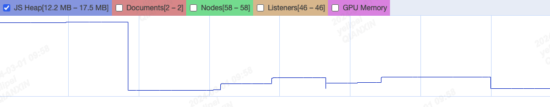
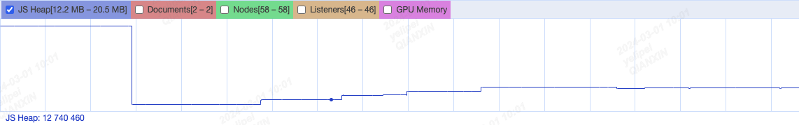

### performance进行内存泄漏调试
#### 例子1
* 首先这个代码没有内存泄漏，然后我们使用performance进行内存泄漏调试 验证下
```html
<button onclick="myClick()">执行fn1函数</button>
<script>
    function fn1 () {
        return new Array(10*10000); // 10w
    }

    let res = [];
    function myClick() {
        fn1();
    }
</script>
```

* 首先我们点击 `开始录制`按钮
* 然后点击一次 `强制垃圾回收`按钮，用于保证干净的测试环境
* 然后一秒点击一次button按钮，点击四次
* 然后一秒点击一次`强制垃圾回收`按钮，点击四次

* 可以看到是点击四次四次都有一个较为明显的上升曲线，但是垃圾回收之后明显下滑到点击按钮之前的状态

#### 例子2
* 首先这个代码有内存泄漏，然后我们使用performance进行内存泄漏调试 验证下
```html
<button onclick="myClick()">执行fn1函数</button>
<script>
    function fn1 () {
        return new Array(10*10000); // 10w
    }

    let res = [];
    function myClick() {
        // 变更，保存了变量,但是后面一直没有使用该变量，并且没有清理
        res.push(fn1());
    }
</script>
```
* 首先我们点击 `开始录制`按钮
* 然后点击一次 `强制垃圾回收`按钮，用于保证干净的测试环境
* 然后一秒点击一次button按钮，点击四次
* 然后一秒点击一次`强制垃圾回收`按钮，点击四次

* 可以看到是点击四次四次都有一个较为明显的上升曲线，
* `但是点击了四次垃圾回收之后并没有明显下滑,和最后一次点击按钮的内存情况类似`

